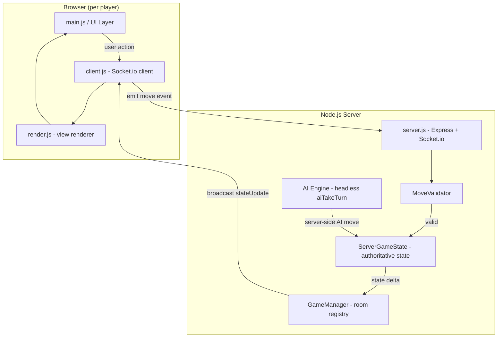
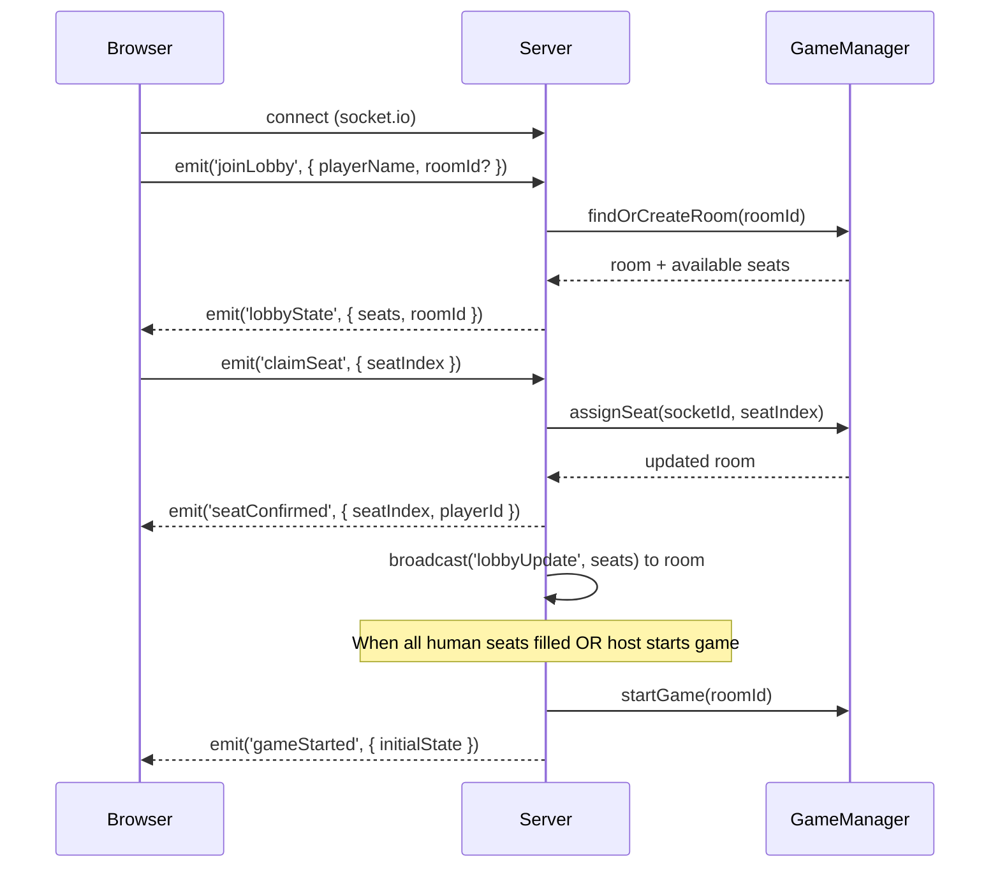
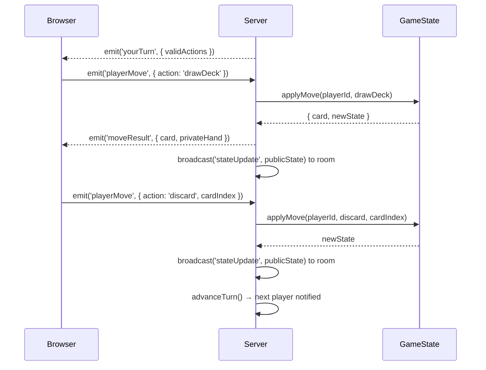
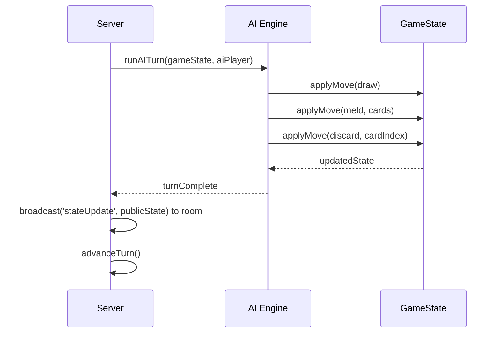

# Design Document: Multiplayer Remote Play

## Overview

This feature adds real-time multiplayer support to the existing Five Crowns browser game by introducing a Node.js server that holds authoritative game state and uses Socket.io to synchronize all connected clients. Remote human players join via a lobby, claim seats, and each see a personalized view of the game — their own hand face-up, opponents' hands as card backs, and the shared deck/discard pile. AI players continue to fill any unseated positions.

The existing single-player client (`classes.js`, `functions.js`, `main.js`, `AI.js`) is refactored to separate pure game logic from DOM rendering, enabling the server to run the same core logic headlessly while each client renders only what its player is permitted to see.

---

## Architecture



---

## Sequence Diagrams

### Player Join & Lobby Flow



### Human Player Turn



### AI Player Turn (Server-Side)



---

## Components and Interfaces

### Component 1: Server (`server.js`)

**Purpose**: Express HTTP server + Socket.io event hub. Owns no game logic — delegates to GameManager.

**Interface**:
```javascript
// Socket.io events received from clients
socket.on('joinLobby',   ({ playerName, roomId }))
socket.on('claimSeat',   ({ seatIndex }))
socket.on('startGame',   ({ roomId }))
socket.on('playerMove',  ({ action, payload }))
socket.on('disconnect',  ())

// Socket.io events emitted to clients
socket.emit('lobbyState',    { roomId, seats })
socket.emit('seatConfirmed', { seatIndex, playerId })
socket.emit('gameStarted',   { publicState })
socket.emit('yourTurn',      { validActions })
socket.emit('moveResult',    { privateHand, card? })
socket.emit('moveRejected',  { reason })
io.to(roomId).emit('stateUpdate',   publicState)
io.to(roomId).emit('lobbyUpdate',   seats)
io.to(roomId).emit('roundOver',     { scores })
io.to(roomId).emit('gameOver',      { finalScores })
```

---

### Component 2: GameManager (`gameManager.js`)

**Purpose**: Registry of active game rooms. Creates, retrieves, and destroys rooms. Manages seat assignment and player reconnection.

**Interface**:
```javascript
class GameManager {
  createRoom(roomId, options)          // → Room
  getRoom(roomId)                      // → Room | null
  findOrCreateRoom(roomId)             // → Room
  assignSeat(roomId, socketId, seatIndex, playerName)  // → { ok, seat }
  releaseSeat(roomId, socketId)        // → void
  reconnectPlayer(roomId, socketId, playerId)          // → { ok, seatIndex }
  startGame(roomId)                    // → ServerGameState
  getPublicState(roomId)               // → PublicGameState
  getPrivateHand(roomId, playerId)     // → Card[]
}
```

---

### Component 3: ServerGameState (`serverGameState.js`)

**Purpose**: Authoritative game state running on the server. Wraps the existing `GameState` class logic (extracted from `classes.js` / `functions.js`) in a headless, DOM-free module. Validates and applies moves, advances turns, triggers AI turns.

**Interface**:
```javascript
class ServerGameState {
  constructor(players, options)
  applyMove(playerId, move)            // → MoveResult | MoveError
  getPublicState()                     // → PublicGameState
  getPrivateHand(playerId)             // → Card[]
  getValidActions(playerId)            // → Action[]
  advanceTurn()                        // → void (internal)
  isCurrentPlayer(playerId)            // → boolean
  serialize()                          // → string (JSON)
  static deserialize(json)             // → ServerGameState
}
```

---

### Component 4: MoveValidator (`moveValidator.js`)

**Purpose**: Pure functions that validate each move type against current game state. No side effects.

**Interface**:
```javascript
function validateDraw(state, playerId, source)         // → { valid, reason? }
function validateDiscard(state, playerId, cardIndex)   // → { valid, reason? }
function validateMeld(state, playerId, cardIndices)    // → { valid, reason?, meldType? }
function validateUnmeld(state, playerId)               // → { valid, reason? }
function getValidActions(state, playerId)              // → Action[]
```

---

### Component 5: Client Socket Layer (`client.js`)

**Purpose**: Thin browser-side Socket.io wrapper. Translates user actions into socket events and routes incoming events to the render layer. Replaces direct DOM mutation for game state changes.

**Interface**:
```javascript
class GameClient {
  connect(serverUrl)                   // → void
  joinLobby(playerName, roomId?)       // → void
  claimSeat(seatIndex)                 // → void
  sendMove(action, payload)            // → void

  // Callbacks set by UI layer
  onLobbyState(fn)                     // fn(lobbyState)
  onGameStarted(fn)                    // fn(publicState, privateHand)
  onStateUpdate(fn)                    // fn(publicState)
  onYourTurn(fn)                       // fn(validActions)
  onMoveResult(fn)                     // fn(result)
  onMoveRejected(fn)                   // fn(reason)
  onRoundOver(fn)                      // fn(scores)
  onGameOver(fn)                       // fn(finalScores)
}
```

---

### Component 6: Remote Render Layer (`remoteRender.js`)

**Purpose**: Replaces the current `renderPlayerHand()` / `displayCard()` calls in `main.js` with a version that renders from server-provided state. Renders the local player's hand face-up and all other players' hands as card backs.

**Interface**:
```javascript
function renderRemoteGameState(publicState, privateHand, localPlayerId)
function renderLobby(lobbyState, localPlayerId)
function renderYourTurn(validActions)
function renderOpponentHand(player)    // always card backs
function renderOwnHand(cards)          // face-up with meld highlights
function renderDiscardPile(topCard)
function renderDeckSize(count)
```

---

## Data Models

### PublicGameState

Sent to all clients on every state change. Contains no private card data.

```javascript
{
  roomId: string,
  roundNumber: number,          // 1–11
  cardsDealt: number,           // roundNumber + 2
  currentPlayerIndex: number,
  finalTurn: boolean,
  players: [
    {
      id: string,               // "p1", "p2", "p3"
      name: string,
      isAI: boolean,
      handSize: number,         // card count only — no card data
      meldSets: Card[][],       // melds are public once laid down
      roundScore: number,
      gameScore: number,
      isOut: boolean,
      connected: boolean
    }
  ],
  discardPile: {
    topCard: Card,              // only top card is visible
    size: number
  },
  deckSize: number,
  phase: 'lobby' | 'playing' | 'roundOver' | 'gameOver'
}
```

### PrivateHand

Sent only to the owning player after each move that affects their hand.

```javascript
{
  playerId: string,
  hand: Card[],                 // full card objects, face-up
  meldSets: Card[][]            // their own melds
}
```

### Move

```javascript
{
  action: 'drawDeck' | 'drawDiscard' | 'discard' | 'meld' | 'unmeld',
  payload: {
    cardIndex?: number,         // for discard
    cardIndices?: number[],     // for meld
  }
}
```

### Seat

```javascript
{
  seatIndex: number,            // 0, 1, 2
  playerId: string | null,
  playerName: string | null,
  socketId: string | null,
  isAI: boolean,
  connected: boolean
}
```

### MoveResult

```javascript
{
  ok: true,
  action: string,
  publicState: PublicGameState,
  privateHand?: PrivateHand     // only sent to the acting player
}
// or
{
  ok: false,
  reason: string
}
```

---

## Algorithmic Pseudocode

### Main Turn Processing Algorithm

```pascal
ALGORITHM applyMove(playerId, move)
INPUT: playerId: string, move: Move
OUTPUT: MoveResult

BEGIN
  ASSERT isCurrentPlayer(playerId) = true
  
  validation ← validateMove(state, playerId, move)
  IF validation.valid = false THEN
    RETURN { ok: false, reason: validation.reason }
  END IF
  
  CASE move.action OF
    'drawDeck':
      card ← state.deck.draw()
      IF card = null THEN
        reshuffleDiscardIntoDeck(state)
        card ← state.deck.draw()
      END IF
      state.players[currentIdx].hand.push(card)
      privateHand ← getPrivateHand(playerId)
      RETURN { ok: true, publicState: getPublicState(), privateHand }
    
    'drawDiscard':
      card ← state.discardPile.pop()
      state.players[currentIdx].hand.push(card)
      privateHand ← getPrivateHand(playerId)
      RETURN { ok: true, publicState: getPublicState(), privateHand }
    
    'discard':
      card ← state.players[currentIdx].hand.splice(move.payload.cardIndex, 1)[0]
      state.discardPile.push(card)
      IF state.players[currentIdx].hand.length = 0 THEN
        state.players[currentIdx].isOut ← true
        state.finalTurn ← true
      END IF
      advanceTurn(state)
      RETURN { ok: true, publicState: getPublicState() }
    
    'meld':
      cards ← move.payload.cardIndices.map(i → hand[i])
      state.players[currentIdx].meldSets.push(cards)
      state.players[currentIdx].hand ← hand without melded cards
      RETURN { ok: true, publicState: getPublicState(), privateHand: getPrivateHand(playerId) }
    
    'unmeld':
      FOR each meldSet IN state.players[currentIdx].meldSets DO
        state.players[currentIdx].hand.push(...meldSet)
      END FOR
      state.players[currentIdx].meldSets ← []
      RETURN { ok: true, publicState: getPublicState(), privateHand: getPrivateHand(playerId) }
  END CASE
END
```

**Preconditions:**
- `playerId` matches `state.players[state.currentPlayerIndex].id`
- `move.action` is one of the defined action types
- For `discard`: player has drawn a card this turn (hand.length = cardsDealt + 1 - meldedCount)
- For `meld`: cardIndices are valid indices into player's hand, cards form a valid meld

**Postconditions:**
- On success: `publicState` reflects the new game state visible to all
- On discard: turn advances to next player
- On going out: `finalTurn = true`, remaining players get one more turn
- On failure: state is unchanged, `MoveError` returned

**Loop Invariants:**
- `state.players[i].hand.length + meldedCardCount(i) = cardsDealt` at start of each turn
- `state.discardPile.length >= 1` after any discard action

---

### Turn Advancement Algorithm

```pascal
ALGORITHM advanceTurn(state)
INPUT: state: ServerGameState
OUTPUT: void (mutates state)

BEGIN
  nextIdx ← (state.currentPlayerIndex + 1) % state.players.length
  
  IF state.finalTurn = true THEN
    // Count how many players have had their final turn
    playersWhoActed ← players where isOut = true OR hadFinalTurn = true
    IF playersWhoActed.length = state.players.length THEN
      endRound(state)
      RETURN
    END IF
  END IF
  
  state.currentPlayerIndex ← nextIdx
  state.currentPlayer ← state.players[nextIdx]
  
  IF state.currentPlayer.isAI = true THEN
    scheduleAITurn(state, delay=500ms)
  ELSE
    emit('yourTurn', { validActions: getValidActions(state, currentPlayer.id) })
      to state.currentPlayer.socketId
  END IF
END
```

---

### Seat Assignment & Reconnection Algorithm

```pascal
ALGORITHM reconnectPlayer(roomId, newSocketId, playerId)
INPUT: roomId: string, newSocketId: string, playerId: string
OUTPUT: { ok: boolean, seatIndex?: number }

BEGIN
  room ← getRoom(roomId)
  IF room = null THEN RETURN { ok: false } END IF
  
  seat ← room.seats.find(s → s.playerId = playerId)
  IF seat = null THEN RETURN { ok: false } END IF
  
  seat.socketId ← newSocketId
  seat.connected ← true
  
  // Re-send current state to reconnected player
  emit('gameStarted', getPublicState(roomId)) to newSocketId
  emit('moveResult', { privateHand: getPrivateHand(roomId, playerId) }) to newSocketId
  
  IF isCurrentPlayer(roomId, playerId) THEN
    emit('yourTurn', { validActions: getValidActions(state, playerId) }) to newSocketId
  END IF
  
  RETURN { ok: true, seatIndex: seat.seatIndex }
END
```

---

## Key Functions with Formal Specifications

### `validateDiscard(state, playerId, cardIndex)`

**Preconditions:**
- `playerId = state.players[state.currentPlayerIndex].id`
- `cardIndex >= 0 AND cardIndex < state.players[currentIdx].hand.length`
- Player has drawn a card this turn (hand size = cardsDealt + 1 minus melded count)

**Postconditions:**
- Returns `{ valid: true }` if all preconditions hold
- Returns `{ valid: false, reason }` otherwise
- No mutation of state

**Loop Invariants:** N/A

---

### `validateMeld(state, playerId, cardIndices)`

**Preconditions:**
- `cardIndices.length >= 3`
- All indices are valid positions in player's hand
- Cards at those indices form a legal Five Crowns meld (set or run, per existing `validateMeld` logic)
- `cardIndices.length < hand.length` (must keep at least 1 card to discard)

**Postconditions:**
- Returns `{ valid: true, meldType: 'set'|'run' }` if valid
- Returns `{ valid: false, reason }` otherwise
- No mutation of state

---

### `getPublicState(state)`

**Preconditions:**
- `state` is a valid `ServerGameState` instance

**Postconditions:**
- Returns `PublicGameState` with no private card data in `players[i].hand`
- `players[i].handSize` equals `players[i].hand.length` in internal state
- `discardPile.topCard` is the last element of `state.discardPile`
- Referentially transparent — same input always produces same output

---

## Example Usage

### Server bootstrap

```javascript
// server.js
const express = require('express');
const { Server } = require('socket.io');
const GameManager = require('./gameManager');

const app = express();
const io = new Server(app.listen(3000));
const gm = new GameManager();

io.on('connection', (socket) => {
  socket.on('joinLobby', ({ playerName, roomId }) => {
    const room = gm.findOrCreateRoom(roomId || 'default');
    socket.join(room.id);
    socket.emit('lobbyState', gm.getLobbyState(room.id));
  });

  socket.on('claimSeat', ({ seatIndex }) => {
    const result = gm.assignSeat(socket.roomId, socket.id, seatIndex, socket.playerName);
    if (result.ok) {
      socket.emit('seatConfirmed', { seatIndex });
      io.to(socket.roomId).emit('lobbyUpdate', gm.getLobbyState(socket.roomId).seats);
    }
  });

  socket.on('playerMove', ({ action, payload }) => {
    const result = gm.applyMove(socket.roomId, socket.playerId, { action, payload });
    if (!result.ok) {
      socket.emit('moveRejected', { reason: result.reason });
      return;
    }
    if (result.privateHand) socket.emit('moveResult', result.privateHand);
    io.to(socket.roomId).emit('stateUpdate', result.publicState);
  });
});
```

### Client connection

```javascript
// client.js (browser)
const client = new GameClient();
client.connect('http://localhost:3000');

client.onGameStarted((publicState, privateHand) => {
  renderRemoteGameState(publicState, privateHand, myPlayerId);
});

client.onYourTurn((validActions) => {
  renderYourTurn(validActions);  // enables draw/discard/meld buttons
});

client.onStateUpdate((publicState) => {
  renderRemoteGameState(publicState, lastPrivateHand, myPlayerId);
});

// User clicks "Draw from deck"
document.getElementById('deck-card').addEventListener('click', () => {
  client.sendMove('drawDeck', {});
});
```

---

## Correctness Properties

- For all players `p` and game states `s`: `getPublicState(s).players[p].hand` contains no card objects — only `handSize: number`
- For all moves `m` applied by player `p`: if `p ≠ currentPlayer`, `applyMove` returns `{ ok: false }` without mutating state
- For all states `s`: `sum(players[i].handSize + meldedCount(i)) + deck.size + discardPile.size = totalCardsInGame`
- For all discard moves: `state.discardPile.length` increases by exactly 1 and `currentPlayer.hand.length` decreases by exactly 1
- For all meld moves with `n` cards: `currentPlayer.hand.length` decreases by `n` and `currentPlayer.meldSets` gains exactly one new set of length `n`
- For all states where `finalTurn = true`: once all non-out players have taken one additional turn, `endRound` is called exactly once
- For all reconnecting players: the private hand sent on reconnect equals the server's current authoritative hand for that player

---

## Error Handling

### Out-of-turn move

**Condition**: Client emits `playerMove` when it is not their turn
**Response**: Server emits `moveRejected { reason: 'not your turn' }` to that socket only
**Recovery**: Client re-renders current state; no state mutation

### Disconnection during turn

**Condition**: Current player's socket disconnects
**Response**: Server marks seat as `connected: false`, starts a 60-second reconnect timer; broadcasts `stateUpdate` with `connected: false` for that player
**Recovery**: If player reconnects within timeout, seat is restored and their turn resumes. If timeout expires, seat is converted to AI control.

### Invalid meld submission

**Condition**: `validateMeld` returns `{ valid: false }`
**Response**: Server emits `moveRejected { reason: 'invalid meld: ...' }` to acting player
**Recovery**: Client re-enables meld UI; player can reselect cards

### Deck exhaustion

**Condition**: `deck.draw()` returns null
**Response**: Server reshuffles discard pile (minus top card) into deck, then draws
**Recovery**: Transparent to clients; `stateUpdate` reflects new deck/discard sizes

### Room not found

**Condition**: Client references a `roomId` that no longer exists
**Response**: Server emits `error { code: 'ROOM_NOT_FOUND' }` and disconnects socket
**Recovery**: Client redirects to lobby to create or join a new room

---

## Testing Strategy

### Unit Testing Approach

Test `MoveValidator` and `ServerGameState` in isolation using Node.js (Jest or similar). Key cases:
- Valid and invalid draw/discard/meld/unmeld for each game phase
- Turn advancement with 2 and 3 players, including final-turn logic
- Score calculation matches existing `saveScoreBoard` logic
- Serialization round-trip: `serialize → deserialize` produces identical state

### Property-Based Testing Approach

**Property Test Library**: fast-check

Key properties:
- Card conservation: total cards across all hands + melds + deck + discard is always constant
- No private data leaks: `getPublicState()` never contains `hand: Card[]` for any player
- Move idempotency: applying the same valid move twice always fails on the second attempt
- Turn order: `currentPlayerIndex` always cycles through `[0, n-1]` in order

### Integration Testing Approach

Use a test Socket.io server with two connected test clients:
- Full game flow: lobby → seat claim → game start → turns → round end → next round → game over
- Reconnection: disconnect mid-turn, reconnect, verify state restored
- AI turn execution: verify AI completes turn and broadcasts state update within timeout

---

## Performance Considerations

- Game state per room is small (~5KB JSON). No database needed for active games; in-memory `Map<roomId, Room>` is sufficient.
- Socket.io rooms handle broadcast scoping natively — no manual filtering needed.
- AI turns run synchronously on the server event loop; for 3 AI players this is negligible. If latency becomes an issue, AI logic can be moved to a worker thread.
- The existing `localStorage` save/restore can be preserved for single-player mode; the server uses its own in-memory state with optional file-based persistence for crash recovery.

---

## Security Considerations

- All move validation happens server-side. The client is untrusted — it can only suggest moves.
- Private hands are never included in broadcast events; each player receives only their own hand via targeted `socket.emit`.
- Room IDs should be unguessable (UUID v4) to prevent uninvited joins.
- Rate-limit `playerMove` events per socket (e.g., max 10/second) to prevent flooding.
- No authentication is required for MVP — player identity is scoped to the socket session. Reconnection uses a server-issued `playerId` token stored in `sessionStorage`.

---

## Dependencies

| Package | Purpose |
|---|---|
| `express` | HTTP server, serves static client files |
| `socket.io` | WebSocket transport with fallback |
| `uuid` | Room ID and player ID generation |
| `jest` | Unit and integration test runner |
| `fast-check` | Property-based testing |

Existing client dependencies remain unchanged. The server is a new `server/` directory alongside the existing flat file structure.

### New File Structure

```
/                          ← existing client files unchanged
  index.html
  main.js
  classes.js
  functions.js
  AI.js
  aiMeldPlanner.js
  client.js                ← NEW: socket.io client wrapper
  remoteRender.js          ← NEW: remote-aware render layer
  lobby.html               ← NEW: lobby/seat selection page

server/
  server.js                ← NEW: Express + Socket.io entry point
  gameManager.js           ← NEW: room registry
  serverGameState.js       ← NEW: headless authoritative game state
  moveValidator.js         ← NEW: pure move validation functions
  package.json             ← NEW: server dependencies
```
